# Architecture Diagrams — Speech Emotion Recognition System

---

## 1. Complete System Architecture

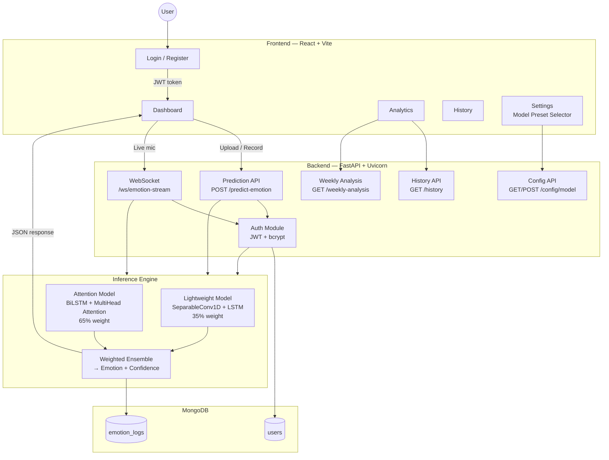

---

## 2. Audio Processing Pipeline

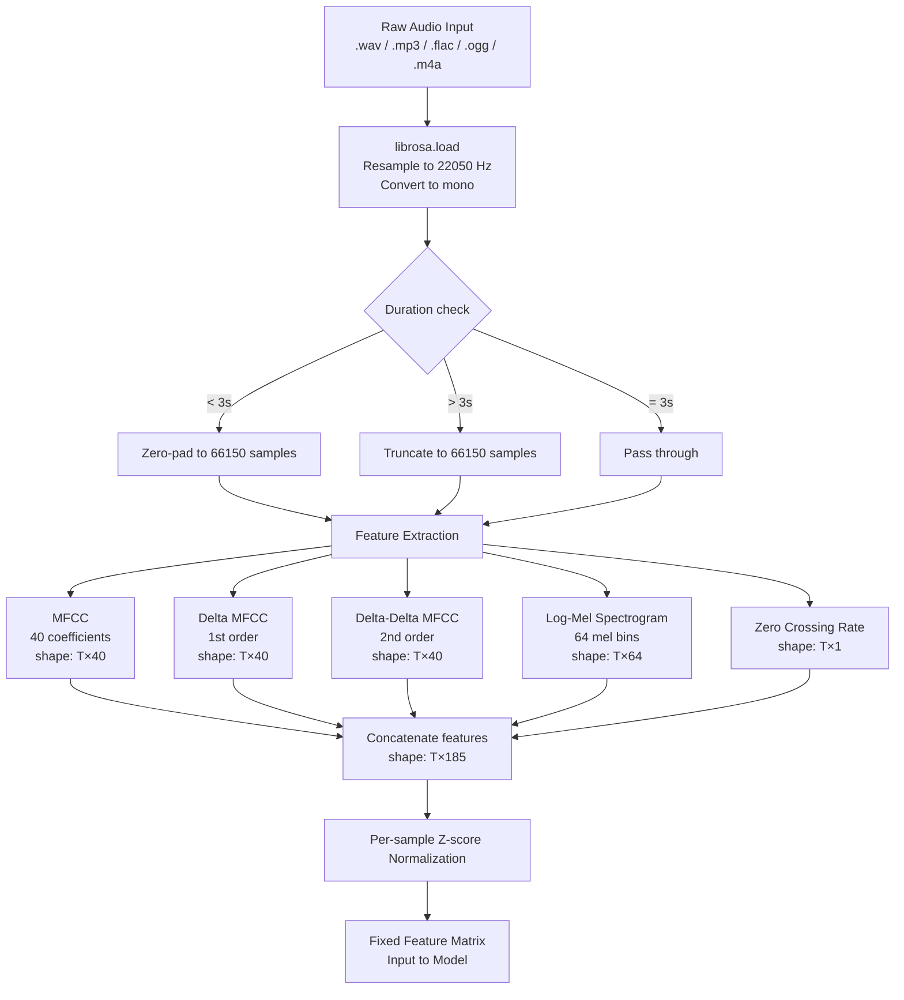

---

## 3. Feature Extraction Detail

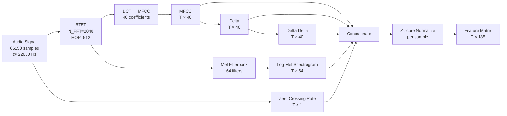

---

## 4. CNN-LSTM Model Architecture

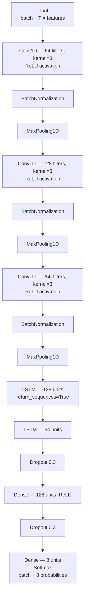

---

## 5. Attention-Based Model Architecture

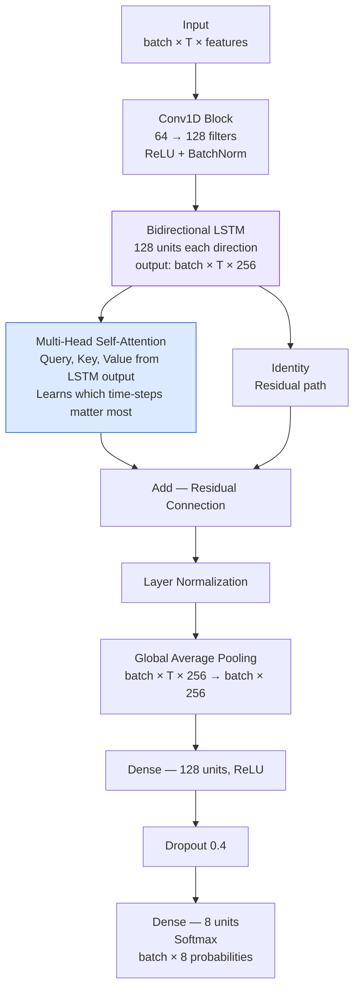

---

## 6. Lightweight Model Architecture

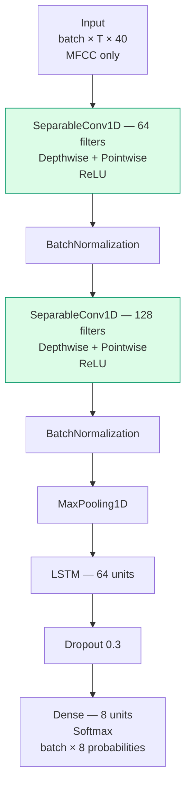

---

## 7. Ensemble Prediction Pipeline

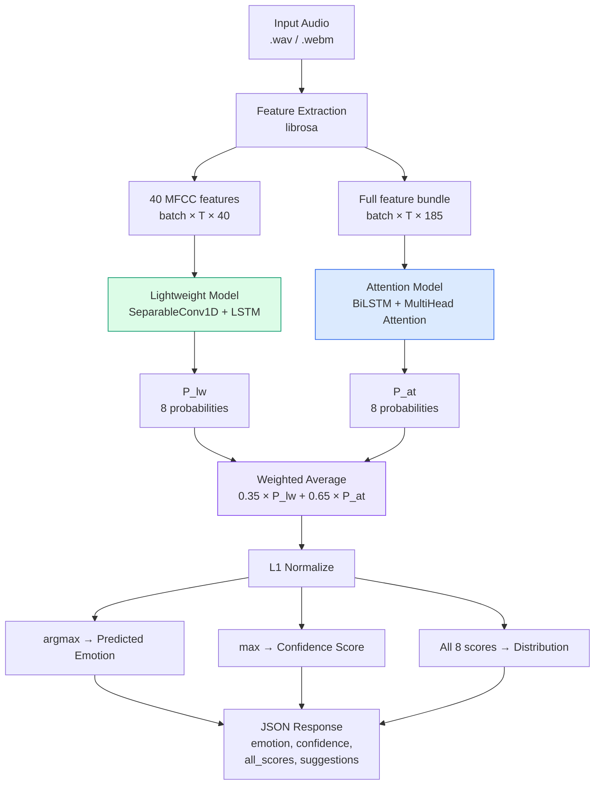

---

## 8. WebSocket Real-Time Streaming Pipeline

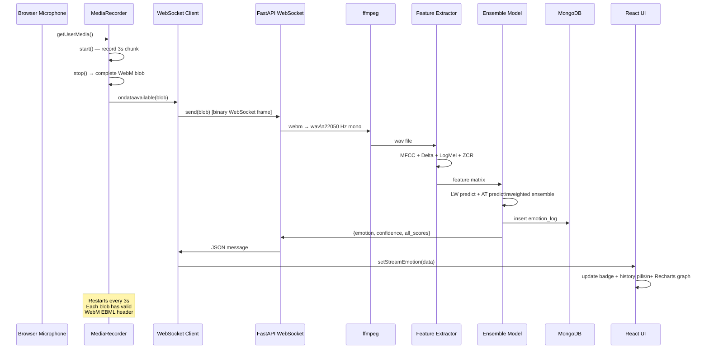

---

## 9. Authentication Flow

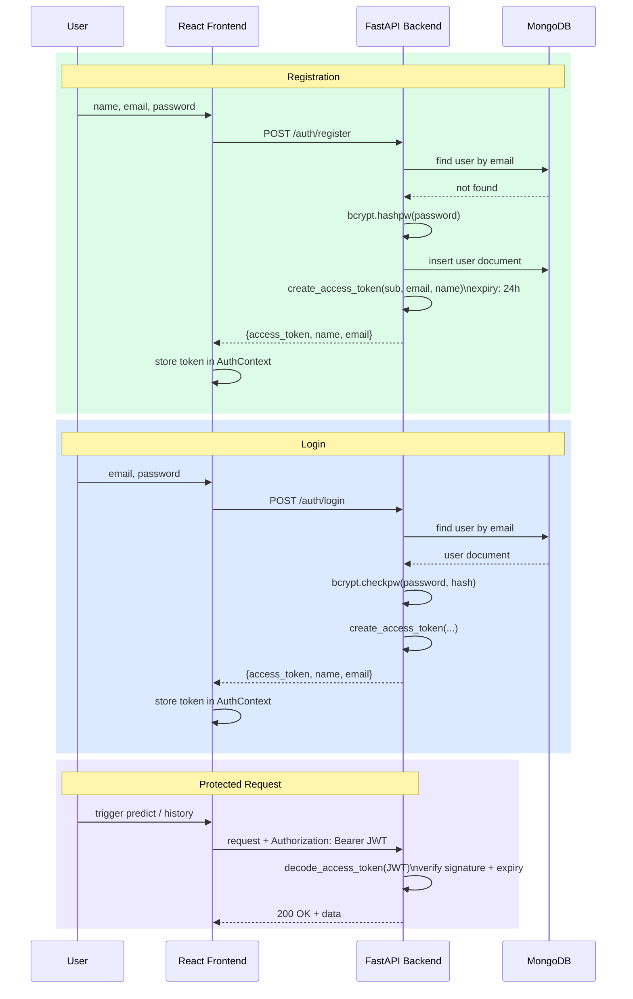

---

## 10. Training Pipeline

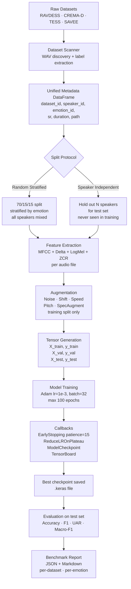

---

## 11. MongoDB Data Flow

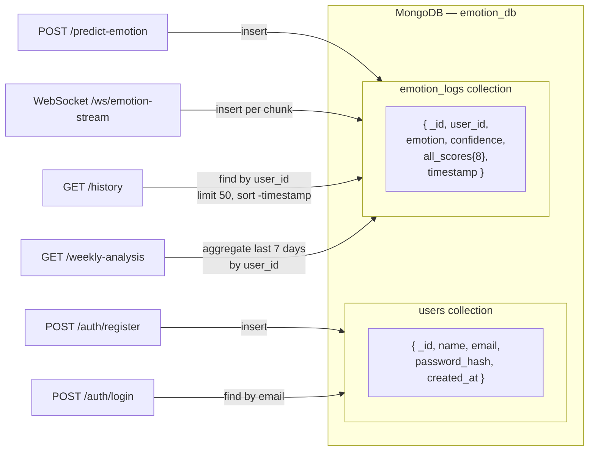

---

## 12. Evaluation Workflow

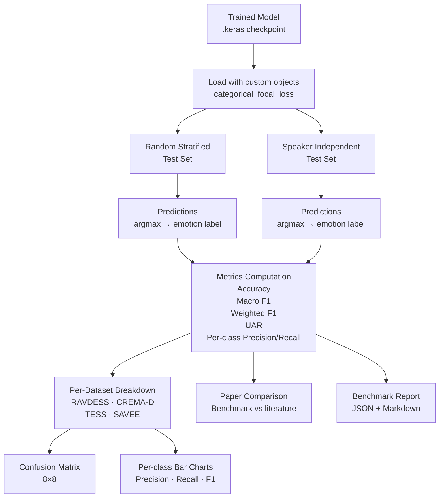

---

## 13. Model Preset Switching (Runtime)

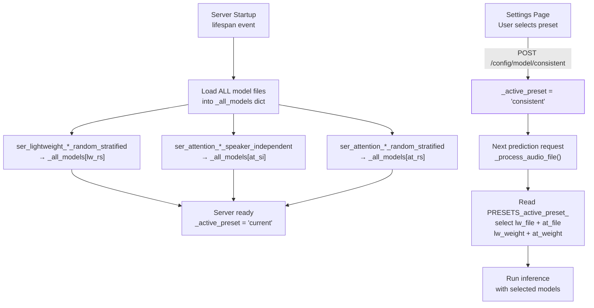

---

## 14. Deployment Architecture

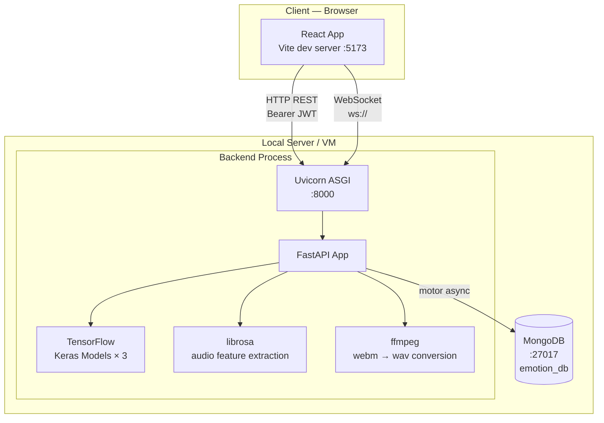
